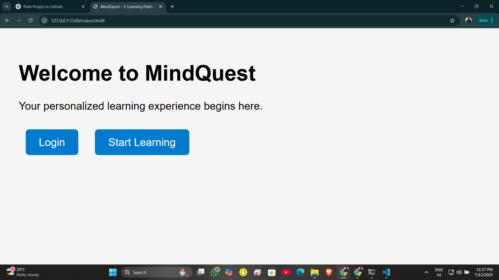
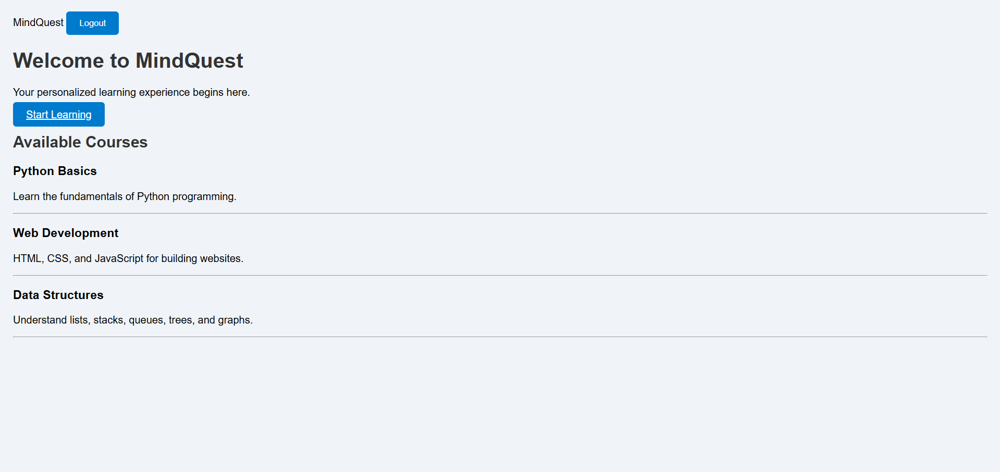

# 💡 MindQuest – E-Learning Platform

MindQuest is a personalized E-Learning web platform built for modern learners. Track your progress, access structured modules, and grow your knowledge through a smooth digital experience.

---

## 🚀 Tech Stack

- 🐍 Python (Backend)
- 🔥 Firebase (Authentication & Database)
- 🌐 HTML, CSS (Frontend)
- ⚙️ VS Code, Git, GitHub

---

## ✅ Features

- 🔐 User Login and Signup
- 📚 Learning Module Navigation
- 📈 Progress Tracking
- 🌐 Firebase Integration (Real-Time)
- 📄 Clean UI for Easy Navigation

---
## 🖼️ Project Screenshot

## 📸 Screenshots

### 🖥️ Home Page

---

## 📁 Folder Structure (Basic)

