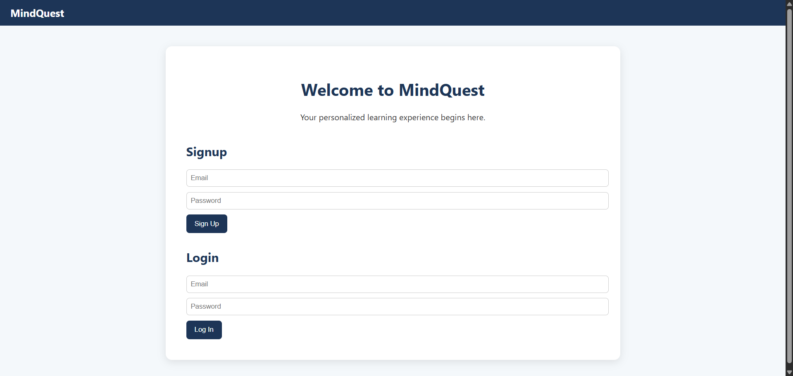
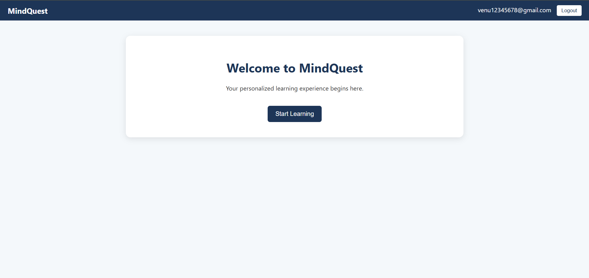
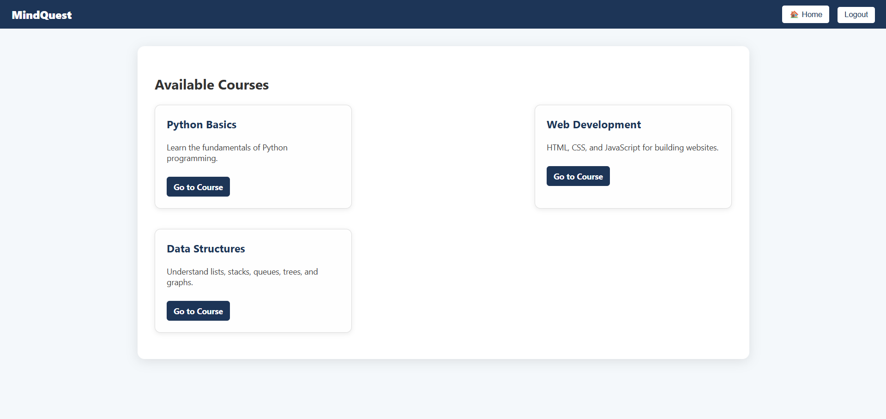

# MindQuest – E-Learning Platform 🧠

A modern e-learning platform built with **Flask**, **Firebase**, and **HTML/CSS**. MindQuest offers users a seamless authentication experience and dynamic access to curated learning resources. It’s designed to demonstrate full-stack web development skills with real-time data and user state management.

---

## 🔧 Tech Stack

**Frontend:**
- HTML5, CSS3  
- Vanilla JavaScript  
- Firebase CDN (Auth, Realtime DB)

**Backend:**
- Python 3  
- Flask (Jinja2 templating, REST API)

**Database:**
- Firebase Realtime Database  
- Firebase Authentication

---

## ✨ Features

- 🔐 User Authentication (Signup, Login, Logout) via Firebase Auth  
- 🧭 Conditional navigation and UI elements based on login state  
- 📚 Courses page fetches real-time content from Firebase via Flask API  
- 🚫 Route protection: Unauthenticated users are redirected to login  
- 👤 Logged-in user's email shown in header  
- 🔁 Post-login redirect to the learning dashboard  
- 🎯 Clean, responsive layout using pure CSS  
- 📂 Organized folder structure and fully functional locally

---

## 📁 Project Structure

```
MindQuest-E-Learning/
├── app.py
├── firebase_config.py
├── firebase-credentials.json
├── templates/
│   ├── index.html
│   └── courses.html
├── static/
│   ├── style.css
│   ├── auth.js
│   ├── courses.js
│   └── firebase_config.js
```

---

## 🛠️ How to Run the Project Locally

1. **Clone the repo**
   ```bash
   git clone https://github.com/your-username/MindQuest-E-Learning.git
   cd MindQuest-E-Learning
   ```

2. **Install dependencies**
   ```bash
   pip install flask firebase-admin
   ```

3. **Add your Firebase credentials**
   - Download your service account JSON file from Firebase Console  
   - Rename it to `firebase-credentials.json` and place it in the root  

4. **Update `firebase_config.js`**
   - Use your Firebase web config (from the Firebase dashboard)

5. **Start the app**
   ```bash
   python app.py
   ```

6. Open browser:
   ```
   http://127.0.0.1:5000/
   ```

---

## 📸 Screenshots

### 🔐 Login & Signup


### 🏠 Home (After Login)


### 📚 Courses Page


---

## 🪪 License

This project is licensed under the **MIT License**.

---

> Built for learning, demonstrating Firebase + Flask integration with real-time auth and data.
## 🧠 What I Learned
Built this project from scratch to understand full-stack development using Firebase and Flask. Learned about real-time databases, authentication, and frontend/backend integration.
